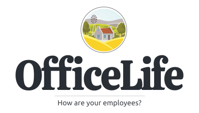

<h1 align="center">
	
</h1>

<h3 align="center">
    All-in-one software to manage the employee lifecycle — with the true cost of your next hire built in
</h3>

	<strong>
		Website: betteroff.fyi (coming soon)
	</strong>

## What is BetterOff HR

BetterOff HR is a fork of the open-source HR platform [OfficeLife](https://github.com/officelifehq/officelife), extended with **BetterOff.FYI**: a hiring-cost and relocation module that shows a startup the true cost of a UK or sponsored overseas hire — and what the candidate gains from the move — at the moment it writes an offer. See [`docs/betteroff/`](docs/betteroff/) for the architecture, the calculation engine, and the golden-scenario verification for that module.

If a company wants to have a complete 360 view of what’s happening inside its walls, it needs to buy and configure a lot of tools. There is a tool for every specific aspect of a company: HR, project management, time tracking, holidays and time offs, team management, One on Ones,... There isn't a software available today, that combine all of them together in a simple way.

BetterOff HR provides a single source of truth for everything an employee does, in 5 major domains:

* 👋 Recruit
   * Applicant tracking system
   * Onboarding / offboarding

* 🤸 Manage
    * Employee management
    * Team management
    * Company management

* 👷‍♀️ Operate
    * Time tracking
    * PTOs (ie holidays and time offs)
    * Expenses management
    * Hardware and software licenses
    * Project management

* ☎️ Communicate
    * Work logs
    * Recent ships
    * Team and company news
    * Get to know your colleagues
    * Wikis

* 🥳 Grow
    Employee and team morale
    * One on Ones
    * Rate your manager
    * Skills
    * e-Coffees
    * Discipline cases

## Who is it for?

BetterOff HR is aimed at early-stage companies with no dedicated HR team, hiring across UK cities or from overseas, who want one tool simple enough for everybody rather than a stack of disconnected specialized software.

## Requirements for hosting the software

- PHP 8.0 or higher,
- the PHP's intl extension,
- a database engine: preferably MySQL or SQLite. PostgreSQL _should_ work, in theory.
- an HTTP server: Nginx, Apache, Caddy, etc...

## Requirements for development

- Composer,
- Node and Yarn,
- A knowledge of how [Laravel](https://laravel.com), [VueJS](https://vuejs.org/) and [InertiaJS](https://inertiajs.com/) work. This is a complex Laravel application, with a lot of queues and cron jobs.

## Contributing

This project wouldn't exist if not for the people who built [OfficeLife](https://github.com/officelifehq/officelife), which this is forked from. See [CONTRIBUTING.md](CONTRIBUTING.md) to get started here.

## License

Licensed under [the BSD 3-Clause license](LICENSE), same as the upstream OfficeLife project this was forked from.
